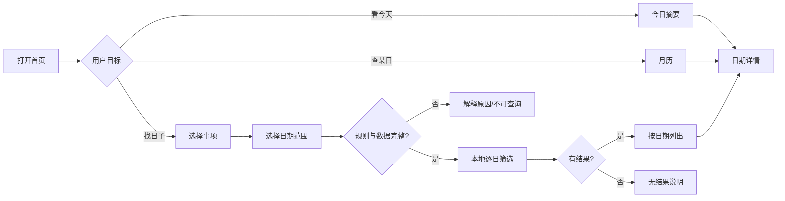
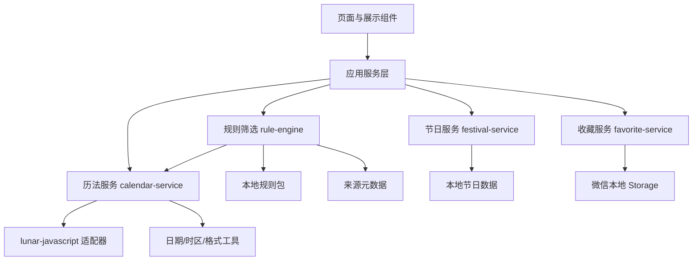

# 《岁月良辰》微信小程序 V1.0 产品与技术方案

> 文档状态：V1.0 方案稿  
> 调研日期：2026-10-08（Asia/Shanghai）  
> 适用技术栈：微信原生小程序（WXML、WXSS、JavaScript、原生 API）  
> 项目性质：个人兴趣项目、非商业化  
> 本文用途：作为后续 Codex 分阶段开发、内容校勘、测试与提审的输入文档；本文不是传统择日结论，也不构成法律意见。

## 文档阅读约定

本文用以下标记区分结论性质：

- **[已核实事实]**：可由古籍原文、国家标准、主管机关、平台官方资料、开源项目源代码或许可证直接支持。
- **[技术建议]**：面向本项目 V1.0 的产品或工程决策，实施前可根据实际 AppID、开发者主体和测试结果调整。
- **[待确认]**：动态政策、尚未完成逐条校勘的规则，或必须在微信公众平台后台/真机环境复核的事项。

> 核心原则：现代农历与节气计算以现行标准和权威历书为校验基准；《钦定协纪辨方书》只作为传统规则的重要文献来源。第三方库输出的“宜忌、吉神、凶煞、黄道日”等内容，除非完成逐条溯源，不得标注为该典籍结论。

## 目录

1. [产品概述](#第一部分产品概述)
2. [功能需求](#第二部分功能需求)
3. [交互与用户体验](#第三部分交互与用户体验)
4. [UI 视觉设计](#第四部分ui-视觉设计)
5. [技术架构](#第五部分技术架构)
6. [传统历法与规则实现](#第六部分传统历法与规则实现)
7. [数据设计](#第七部分数据设计)
8. [审核与合规](#第八部分审核与合规)
9. [测试与验收](#第九部分测试与验收)
10. [开发实施计划](#第十部分开发实施计划)

---

## 0. 调研结论摘要

### 0.1 传统历法与古籍

1. **[已核实事实]** 《钦定协纪辨方书》为清代官修术数典籍，四库全书本共三十六卷。目录可见“本原”“义例”“立成”“宜忌”“用事”“公规”以及年表、月表、日表、利用等部分；其中卷十“宜忌”及其“铺注条例”、卷十一“用事”、卷十二至十三“公规”与按事项选择日期最直接相关。卷一至八还系统列出干支、五行、建除十二神及多类神煞义例。
2. **[已核实事实]** 该书不是一张可直接照搬成现代数据库的“每日宜忌表”。它包含定义、推演、表格、用事分类、总规则、引文、辨误与历史语境；不同规则存在层级、条件和冲突处理，不能只抓取某个“宜”字或某个神煞名称就下结论。
3. **[已核实事实]** 现行农历是阴阳合历。朔所在的北京时间民用日为农历初一；月长由相邻两次朔所在日期的间隔决定；含冬至的月为十一月；当两个十一月之间有十三个农历月时，依“不含中气”的规则置闰。现行国家标准为 GB/T 33661—2017《农历的编算和颁行》，目前在全国标准信息公共服务平台显示为现行。
4. **[已核实事实]** 二十四节气按太阳视运动划分，每相隔黄经 15°形成一个节气时刻；节气是时刻而不仅是日期。页面按“日”展示时，应将交节时刻换算到北京时间后归属到对应公历日。
5. **[技术建议]** V1.0 可算法化的范围只包括：公历/农历转换、星期、明确口径的干支字段、节气时刻与所在日、经校勘的节日、以及能够表示为确定条件且已逐条录入来源的规则。涉及个人八字、方位、时辰、家族身份、地域习俗、现场条件或存在版本争议的规则，不进入 V1.0 自动筛选。

### 0.2 `lunar-javascript` 评估

1. **[已核实事实]** 项目 README 和 `package.json` 表明，该库无运行时第三方依赖，提供公历、农历、干支、节气、节日以及大量传统历书字段；许可证为 MIT。当前调研时仓库 `package.json` 显示版本 1.7.7。
2. **[已核实事实]** 该库自身的变更记录曾修复每日宜忌、节气、闰月后干支、吉神凶煞等问题；公开 issue 中仍有节气、时区、吉神凶煞及农历转换等待核实报告。这说明“功能很多”不等于“所有输出均可无条件作为权威结果”。
3. **[技术建议]** V1.0 只将其作为候选的**基础历法计算适配器**，首批只使用经测试的公农历转换、星期、节气、干支基础字段。库内宜忌、吉神凶煞、黄黑道、八字等结果默认禁用，不能直接进入页面或筛选器。
4. **[待确认]** 在真正引入前，应固定准确版本/提交号，核对压缩后体积、微信 JavaScript 运行环境兼容性、时区行为、可裁剪性，并用权威样本回归。本文不授权直接安装依赖。

### 0.3 微信小程序与合规

1. **[已核实事实]** 微信原生小程序由逻辑层与渲染层构成，页面通常由同名的 `.js`、`.wxml`、`.json`、`.wxss` 文件组成；本地缓存可用 `wx.setStorage`/`wx.getStorage` 等 API。官方资料说明单个 key 最大 1 MB、总缓存上限 10 MB，且缓存可能因用户删除或系统清理而丢失。
2. **[已核实事实]** 工信部关于 APP 备案的通知明确将小程序纳入 APP 分发形态；在境内提供互联网信息服务应履行备案，备案号应在显著位置展示并按要求链接备案系统。非商业化不构成备案豁免。
3. **[已核实事实]** 微信小程序平台运营规范禁止宣扬邪教和封建迷信。传统历法文化介绍不当然等于封建迷信，但“预测命运、保证灵验、消灾改运、恐吓诱导、付费化解”等表达具有高风险。
4. **[技术建议]** 服务类目首选候选为“工具—日历”；若后台实际类目层级或名称不同，按提交时官方页面和当前 AppID 可选项为准。不得为了过审选择与实际内容不符的类目。
5. **[待确认]** 类目、个人主体可用能力、隐私接口清单和审核尺度都会变化。提审前必须在微信公众平台后台再次核验，并保留页面截图、核验日期和审核反馈。

---

# 第一部分：产品概述

## 1.1 产品定位

「岁月良辰」是一款面向日常生活的传统历法查询与民俗日期规划工具。它提供准确、清晰的公历—农历信息，以及对来源明确的传统历法规则进行检索和解释。

产品不扮演“大师”，不提供命理预测，不声称选择某日会导致特定结果。找日子功能的定义是：

> 在用户给定事项与日期范围内，列出符合本版本已收录、可追溯传统规则的日期，并展示匹配依据、缺失信息与适用边界。

## 1.2 目标用户

- 想同时查看公历、农历、干支、节气和传统节日的普通用户。
- 对传统历书、民俗文化有兴趣，希望理解“为什么写宜/忌”的用户。
- 在婚嫁、搬家、祭祀、出行等事项前，希望获得传统文化层面日期参考，但会结合现实安排自行决策的用户。
- 需要收藏纪念日或待办日期、但不需要账号和跨设备同步的轻量用户。

非目标用户：寻求八字合婚、命运预测、法事改运、趋吉避凶保证、专业殡葬安排、宗教服务或商业决策保证的人群。

## 1.3 核心使用场景

| 场景 | 用户目标 | 最短路径 |
| --- | --- | --- |
| 看今天 | 快速知道今日公历、农历、节气、节日和已收录宜忌 | 打开小程序即见 |
| 查某日 | 查看过去或未来某一天的完整历法信息 | 日历 → 点日期 → 详情 |
| 找日子 | 按事项和日期范围筛选有据可查的参考日期 | 找日子 → 选事项/范围 → 查询 → 详情 |
| 收藏日期 | 保存一个重要日期供本机再次查看 | 详情 → 收藏 |
| 看依据 | 了解规则来自何处、采用什么口径 | 详情 → 规则依据 |

## 1.4 产品特色

- **口径透明**：区分现代历法计算、节日数据和传统规则，不混为一个“黄历结果”。
- **来源可追溯**：每条进入筛选的规则都能定位到版本、卷次、条目或页码/影像。
- **保守输出**：不随机、不用 AI 自由推断、不使用主观打分；冲突或数据不足时宁可不出结果。
- **现代东方美学**：传统历书气质与现代移动界面的高可读性结合。
- **轻量离线**：V1.0 无登录、无后端；核心查询和收藏可在本机完成。

## 1.5 V1.0 目标

1. 四个页面闭环可用：首页、日历、日期详情、找日子。
2. 基础日期结果有明确口径，并通过闰月、跨年、节气边界测试。
3. 至少形成一个经过校勘、带来源、可回归测试的规则包；只有状态为 `verified` 的事项才允许查询。
4. 用户在三步内完成“选事项—选范围—看结果”。
5. 收藏可稳定写入本地并在详情页即时反映。
6. 文案和功能边界满足“文化资料/工具”定位，不出现命理预测或效果保证。

## 1.6 功能边界

### V1.0 包含

- 中国标准时间（UTC+8）口径下的公历、农历、星期。
- 明确标注换年/换月口径的年、月、日干支。
- 二十四节气及交节时刻（若库结果已通过验证）。
- 经人工整理的传统节日与纪念日标签。
- 经逐条校勘的少量传统宜忌与事项筛选。
- 本地收藏。
- 当前页面的微信原生转发能力（不生成复杂海报）。

### V1.0 明确不包含

- 用户体系、登录、云同步、后端、数据库、管理后台。
- 八字、生肖配对、合婚、命盘、运势、风水、方位、改运、消灾、法事。
- 结合姓名、出生时间、家庭成员生肖或住宅坐向的个性化择日。
- 随机“吉日”、AI 生成规则、综合吉凶分、成功率或“最佳/必成”等承诺。
- 付费、会员、广告、社区、评论、用户公开内容。
- 法定节假日调休的长期内置预测；如展示，只能使用明确年份、明确来源的数据。

### 事项支持策略

**[技术建议]** 找日子事项采用状态门禁：

- `supported`：规则完整、来源已定位、测试已通过，可点击查询。
- `limited`：已有 `verified` 规则可查询，但条目未收全；结果必须在事项入口、结果列表上方、详情页规则区三处显示覆盖范围。
- `reviewing`：正在校勘，列表展示但置灰，并说明“规则整理中”。
- `unsupported`：依赖个人命盘、时辰、方位或资料争议较大，V1.0 不提供。

首批从“祭祀、出行、般移/移徙”中只选择一类先做完整校勘，再评估是否扩充。现代“搬家”可作为“般移/移徙”的界面别名；卷十一未检出独立“入宅”条目，不能直接把二者互换。“开业”可作为“开市”的现代别名。“嫁娶”“结婚姻”“纳采问名”在原书中分列，现代“订婚”不能未经审校就合并；安葬还可能涉及山向、形势等日期以外条件。

**[已核实事实] 2026-10-10 落地情况**：出行、搬家、开业、婚嫁四个事项已完成专项校勘并开放查询，均为 `limited`（规则包 `partial`）；入宅与安葬仍为 `reviewing`／`unsupported`，入口置灰且不可触发查询。婚嫁只承接原书“嫁娶”一条，“结婚姻”“纳采问名”分列不并，见上文事项卡。

---

# 第二部分：功能需求

## 2.1 首页

### 页面职责

提供“今天是什么日子”的一屏摘要，以及通往找日子、日历、日期详情的最快入口。

### 功能与数据

| 区域 | 展示 | 操作 |
| --- | --- | --- |
| 今日主卡 | 公历年月日、星期、农历、年/月/日干支 | 点主卡进入今日详情 |
| 节气节日 | 当日节气、下一个节气及倒计时天数、传统节日 | 点标签进入详情对应区块 |
| 宜忌摘要 | 最多各 4 项，只来自已验证规则包 | 点“查看全部与依据”进入详情 |
| 核心入口 | “找日子”“看日历”两个等权按钮 | 分别切换到对应 tab |
| 说明 | “传统文化参考，请结合实际安排” | 点开简短说明，可进入关于/规则说明（可用弹层，不新增核心页） |

### 交互反馈

- 首屏先同步计算今日基础日期，再渲染摘要；计算目标为普通设备无可感知等待。
- 收藏不是首页首要操作，不在首页堆叠收藏列表。
- 当天没有节气/节日时，显示“今日无已收录节气或节日”，不留空白卡片。
- 宜忌规则未加载或未验证时，显示“今日传统规则资料整理中”，不回退到第三方库宜忌。

### 异常状态

- 日期计算失败：保留公历日期，规则卡显示“历法信息暂不可用”，提供“重新计算”。
- 设备时间异常或年份超范围：提示“设备日期超出本版本支持范围”，不生成替代结果。
- 局部模块失败不得导致整个首页白屏。

### 验收标准

- 冷启动后能看到正确的本机今日（按 UTC+8 归一）公历日期。
- 主卡、找日子、日历三个入口均可达且返回路径正确。
- 页面没有“今日大吉”“诸事皆宜”等无依据概括。
- 规则不可用时不会展示伪造宜忌。

## 2.2 日历

### 页面职责

以月为单位浏览公历、农历、节气和节日，并进入具体日期详情。

### 功能与数据

- 顶部显示当前年月，支持上月、下月和“回到今天”。
- 固定七列，从周一或周日开始必须全局一致；**[技术建议]** 采用周一开始，并在设置说明中明确。
- 每格显示公历日号、农历日名；优先标签顺序为“节气 > 传统节日 > 农历初一/月名 > 农历日名”。
- 今日、用户选中日、非本月补位日、节气日分别有可区分但不过度依赖颜色的状态。
- 点击非本月补位日时先切换到该月并保持选中，再进入详情；也可直接进入详情，但全项目必须统一，建议直接进入详情以减少一步。

### 操作与跳转

- 左右箭头切月；可选支持水平滑动，但滑动与纵向滚动冲突时以按钮为主。
- 点年月标题打开原生或轻量年月选择器，选择范围受产品支持年份限制。
- 点日期进入 `/pages/day-detail/day-detail?date=YYYY-MM-DD&from=calendar`。
- 回到今天后，月份和选中态同时复位。

### 空状态与异常状态

- 该月无节日不是异常，仅不显示节日标记。
- 月数据计算失败时显示失败占位与“重试”，保留月份导航。
- 超出支持年份时禁用切换按钮并提示支持范围。
- 某日规则数据缺失不影响日期格显示；详情页单独标记缺失。

### 验收标准

- 28、29、30、31 天月份的首尾补位正确。
- 跨年切换、闰年 2 月、农历闰月期间显示正确。
- 连续快速切月不会出现旧月份覆盖新月份。
- 42 个日期格只计算一次并使用稳定 `wx:key`；切月过程中无明显卡顿。
- 节气日与权威样本日期一致。

## 2.3 日期详情

### 页面职责

展示某一天的完整、分层、可追溯信息，是所有查询结果的解释页。

### 信息顺序

1. 日期抬头：公历、星期、农历。
2. 干支与节气：年/月/日干支，采用口径标签；节气名称与交节时刻。
3. 节日：传统节日、公共纪念日分组，避免概念混合。
4. 传统宜忌：按“已验证规则”展示适用事项和不适用事项。
5. 文化解释：解释术语，不作结果保证。
6. 规则依据：来源版本、卷次/条目、规则编号、验证状态、适用限制。
7. 收藏按钮和免责声明。

### 用户操作

- 点收藏按钮切换收藏；成功后轻提示“已收藏/已取消”。
- 点规则条目展开依据；一次只展开一个，避免长页面失控。
- 点来源链接只在合规且可访问时复制链接或使用允许的 web-view 能力；个人主体可能不支持 web-view，因此 V1.0 默认展示可复制的书目信息，不依赖内嵌网页。
- 右上角微信菜单可转发当前日期；分享路径只携带 `date`，不携带用户收藏或其他本地信息。

### 空状态与异常状态

- 无节日：显示“无已收录节日”。
- 无规则：显示“本日暂无已完成校勘的传统规则”，而不是“诸事不宜”。
- 有冲突：显示“规则存在未决冲突，本版本不作筛选结论”，列出冲突规则编号。
- 日期超范围或参数非法：显示明确错误和“返回今天”，不得静默改成今日。
- 本地收藏写入失败：回滚按钮状态并提示，不伪装成功。

### 验收标准

- 从首页、日历、找日子进入同一日期时，基础信息完全一致。
- 每个宜忌标签至少关联一个 `verified` 规则及一个来源定位。
- 页面能区分“无数据”“无匹配”“有明确排除”三种语义。
- 收藏后退出再进入仍存在；用户清理缓存后丢失属于已说明边界。

## 2.4 找日子

### 页面职责

让用户按事项与日期范围检索符合当前规则包的参考日期，并清楚解释结果为何出现或为何缺失。

### 查询流程

1. 选择事项：单选。默认不预选，避免误触即查询。
2. 选择范围：默认今天起 30 天；最早为今天，最长 90 天；支持自定义起止日期。
3. 检查事项状态与范围。
4. 本地逐日计算基础历法字段，执行该事项的已验证规则。
5. 按日期升序输出，不做“吉利分数”排序。
6. 点击结果进入日期详情。

### 事项卡

每项展示：现代名称、对应古籍用语、状态、简短边界。例如：

- 出行（对应“出行”“行幸遣使”）：`limited`。条目宜 16／忌 16 已录入；因天德在四仲月以四维记位、无值日可判，不升级为 `supported`。
- 搬家（对应“般移”，原注“移徙同”）：`limited`。条目宜 14／忌 15 已录入，起例全部回看影印本。
- 入宅：`reviewing`；卷十一全卷（三份用事清单及逐条宜忌）均无同名条目，不得直接并入搬家，也不得按现代语义自造条目。
- 开业（对应“开市”）：`limited`。条目宜 6／忌 19 已录入。
- 婚嫁（对应“嫁娶”）：`limited`。条目宜 10／忌 20 已录入。同卷另有分列的“结婚姻”“纳采问名”，宜忌与本条不同（都收“五合”、都不收“不将”），不可笼统合并，本版本未收录、也不为其开查询入口。
- 安葬：`unsupported`；V1.0 不接收逝者信息、方位或时辰，日期还取决于山向与形势，无法在现有规则模型内落地。

### 结果卡

每张卡展示：公历日期、星期、农历、节气/节日、收藏状态，点“查看当天参考”进入详情。

**[已核实事实] 依据摘要已放弃**：本节原定“命中的纳入规则摘要，最多显示两条依据”。实际实现后复盘认为，结果卡上列规则名会让传统术语抢在用户结论之前出现，且与详情页重复，故 `FindDateResultItem` 只保留 `dateKey`、`weekdayText`、`lunarText`、`tagText` 四个字段，依据一律进详情页看。`tests/find-date-service.test.ts` 有用例锁定该字段集合，防止再被加回来。服务层原先为此准备的 `ruleTexts` 与 `matchedCount` 已删除。

禁止展示：星级、百分比、综合分、“最佳日”“大吉”“稳赢”等主观或保证性表达。

### 状态处理

| 状态 | 判断 | 页面处理 |
| --- | --- | --- |
| 有结果 | 至少一日通过所有已声明的硬性规则，且无未决冲突 | 日期升序列表 + 规则口径说明 |
| 无结果 | 范围内日期均被明确规则排除 | 提示扩大范围；显示“不是现实安排上的不可用” |
| 无规则数据 | 事项不可查询（`reviewing`／`unsupported`）或规则包未加载 | 禁止查询，说明整理状态 |
| 数据异常 | 某些日期计算失败、来源版本不匹配 | 整次查询标为不完整；默认不输出“合格”结论，允许重试 |
| 范围非法 | 起日大于止日、超过 90 天、超出支持年份 | 就地提示并阻止查询 |
| 规则冲突 | 纳入与排除规则同级且无已核实裁决 | 该日期不进入结果，记入“需人工核对”计数 |

### 验收标准

- 只对 `supported` 与 `limited` 事项开放查询（门禁集中在 `canQueryEventType()` 一处，页面与服务不得各自比较字面量）。
- 相同事项、范围、规则版本得到稳定且可重复的结果。
- 结果顺序只有日期顺序，不受对象遍历顺序或随机数影响。
- 每个结果可解释到规则和来源；任一来源失效时对应结果不进入正式列表。
- 查询 90 天在目标真机上无明显卡顿；必要时分批计算并更新进度。

---

# 第三部分：交互与用户体验

## 3.1 信息架构与导航

```text
底部原生 TabBar
├─ 首页
│  └─ 今日详情（日期详情页）
├─ 日历
│  └─ 任意日期详情（日期详情页）
├─ 找日子
│  ├─ 事项/范围选择
│  ├─ 查询结果（同页状态切换）
│  └─ 结果日期详情（日期详情页）
└─ 关于
   └─ 应用介绍、标准与校验资料、传统文献与文化资料、完整免责声明（同页分区）

日期详情（非 Tab 页）
├─ 规则依据展开
└─ 收藏/取消收藏
```

采用 4 个原生 tab，日期详情作为二级页。结果不单独拆页，可减少页面状态同步和返回路径复杂度。

> 2026-10-10 变更说明：「关于」是发布准备阶段新增的第四个 tab，原方案为 3 个；本文其余章节中遗留的“四页”“3 个 tab”“3-tab”等表述，均指加入“关于”之前的形态，不再逐一改写。

## 3.2 关键操作流程



## 3.3 日期选择与月历交互

- 单日查看用月历点选；找日子范围使用开始/结束两个明确字段，不使用难以操作的拖拽范围。
- 原生 `picker mode="date"` 可作为无障碍和小屏兜底；若视觉统一而自定义选择器，仍需提供清晰的选中态和取消入口。
- 日期统一在页面间传 `YYYY-MM-DD`，不传 JavaScript 时间戳，避免时区和序列化偏移。
- 用户切月时保留同一日号；目标月没有该日号时取该月最后一日，但不自动打开详情。
- 月历格最小可点击区域建议 80rpx × 80rpx；标签过长截断，不挤压日号。

## 3.4 查询结果呈现

- 顶部固定显示“事项 + 范围 + 规则包版本”，避免用户忘记筛选条件。
- 结果卡先展示日期，再展示“符合哪些已收录条件”；不以红色大字制造确定性。
- 若有被排除/冲突日期，不逐日灌输负面信息，只提供汇总：“共检查 30 日，3 日符合；2 日因规则冲突未列入”。
- 修改事项或范围后，旧结果立即标记为已过期，直到重新查询。

## 3.5 收藏操作

- 收藏只存 `date`、可选备注名（V1.0 可暂不提供编辑备注）、创建时间、数据版本。
- 详情页使用图标加文字“收藏/已收藏”，不能只靠颜色。
- 收藏上限建议 200 条；达到上限时提示用户取消旧收藏，不自动删除。
- V1.0 不提供收藏列表独立页；可在日历中以小圆点标记收藏日期。若开发量超出，可推迟到 V1.1，收藏仍可从详情页读写。

## 3.6 加载与错误反馈

- 小于约 300 ms 的同步计算不显示 loading，避免闪烁；较长查询显示“正在核对 12/90 日”。
- 错误文案必须包含“发生了什么 + 用户能做什么”，如“规则数据未完整加载，请重试”。
- Toast 只用于收藏等短反馈；空状态和关键错误使用页面内卡片，不能一闪而过。
- 重试必须幂等；快速连续点击查询时，只采纳最新一次查询令牌对应的结果。

## 3.7 小屏、无障碍与可读性

- 以 320px 宽等效设备做最小宽度测试；主要内容单列，不使用横向信息表格。
- 正文字号不低于 28rpx，辅助说明不低于 24rpx；行高 1.5 左右。
- 红/绿不作为唯一语义。宜、忌同时配文字和边框/图标；焦点态、选中态有形状差异。
- 操作按钮最小高度 88rpx，图标按钮提供可读文字或 `aria-label`（以当前基础库支持为准）。
- 支持系统字体放大后的主要操作；长规则来源允许换行。
- 动画控制在 150–240 ms，只用于状态过渡；不使用持续飘动、转盘或仪式化特效。

---

# 第四部分：UI 视觉设计

## 4.1 视觉原则

现代东方美学通过留白、纸张色、细线、克制的朱砂红和少量淡金实现，不使用仿古卷轴、罗盘、八卦阵、火焰、符咒或夸张书法背景。优先保证信息层级与可读性。

## 4.2 色彩规范

| 角色 | HEX | 用途 |
| --- | --- | --- |
| 纸白背景 | `#F7F3EA` | 页面主背景 |
| 卡片白 | `#FFFDF8` | 卡片、弹层 |
| 主墨色 | `#24211E` | 标题、重要日期 |
| 次墨色 | `#625B53` | 正文、说明 |
| 淡墨色 | `#8D857C` | 辅助信息、禁用文字 |
| 朱砂红 | `#B44335` | 主按钮、今日、选中态 |
| 深朱砂 | `#8E3027` | 按压态、强调文字 |
| 淡朱砂底 | `#F4E4DF` | “宜”或选中标签浅底 |
| 淡金 | `#C8A96B` | 细分隔、节气点缀，不用于大面积文字 |
| 边线 | `#DED7CB` | 卡片和日历格边线 |
| 提示蓝灰 | `#E9EFF1` / `#45606A` | 中性信息提示 |
| 错误 | `#A33A32` | 数据错误与阻止操作；配图标/文字 |

对比度以正文可读为先；淡金不得单独承载小字号文本。

## 4.3 字体与字号

不引入网络字体。使用系统中文字体栈，由微信客户端决定实际字体；数字采用系统等宽数字特性不可保证，因此布局不能依赖固定字宽。

| 层级 | 字号 | 字重 | 行高 |
| --- | --- | --- | --- |
| 今日日期大字 | 64–72rpx | 600 | 1.1 |
| 页面标题 | 40rpx | 600 | 1.3 |
| 卡片标题 | 32rpx | 600 | 1.4 |
| 正文 | 28rpx | 400 | 1.55 |
| 标签/辅助 | 24rpx | 400/500 | 1.4 |
| 极小注释（谨慎） | 22rpx | 400 | 1.4 |

## 4.4 间距、圆角与阴影

- 基础间距单位：8rpx；常用间距：8、16、24、32、48rpx。
- 页面左右边距：32rpx；卡片内边距：28–32rpx；区块间距：24rpx。
- 卡片圆角：24rpx；按钮圆角：20rpx；标签圆角：999rpx；日历选中圆形直径约 64rpx。
- 阴影仅用于浮层或核心主卡：`0 8rpx 24rpx rgba(36,33,30,0.06)`；普通卡片优先用 1rpx 边线。

## 4.5 组件样式

### 卡片

- 背景 `#FFFDF8`，1rpx 边线 `#DED7CB`。
- 标题、内容、操作区三段式；无内容的段落不保留空白。
- 规则来源卡左侧可用 4rpx 淡金线，但不使用大面积金色。

### 按钮

- 主按钮：朱砂红底、白字、高 88rpx；按压为深朱砂。
- 次按钮：透明/卡片白底、朱砂红文字、1rpx 朱砂边线。
- 文字按钮：次墨色，点击态淡朱砂底。
- 禁用：`#E8E2D8` 背景、`#9B948B` 文字，并保留“为何禁用”的说明。

### 标签

- “节气”：淡金描边 + 主墨字。
- “节日”：淡朱砂底 + 深朱砂字。
- “宜/符合”：纸白或淡朱砂底 + 朱砂边，不使用绿色。
- “忌/排除”：透明底 + 次墨/错误色边框，避免恐吓感。
- “待校勘”：蓝灰底 + 蓝灰字。

### 日历格

- 公历日号 30rpx；农历/标签 22–24rpx。
- 今日：朱砂细环 + “今”小角标。
- 选中：朱砂实心圆、白色日号；附属文字保持可读。
- 非本月：整体 45% 视觉权重但仍可点击。
- 收藏：日号下方 6rpx 实心淡金点。

## 4.6 页面线框图

### 首页

```text
┌──────────────────────────┐
│ 岁月良辰                  │
│                          │
│  2026 年 10 月 8 日      │
│  星期四 · 农历……         │
│  ○ 年柱  ○ 月柱  ○ 日柱 │
│  [节气] [节日]           │
│                    详情 >│
├──────────────────────────┤
│ 今日传统规则参考          │
│ 宜  · … · …              │
│ 忌  · … · …              │
│ 已校勘规则 3 条      依据 >│
├────────────┬─────────────┤
│   找日子   │    看日历    │
└────────────┴─────────────┘
  首页          日历      找日子
```

### 找日子

```text
┌──────────────────────────┐
│ 找日子                    │
│ 选择事项                  │
│ [出行] [搬家] [开业]     │
│ [婚嫁] [入宅·整理中]     │
│ [安葬·不提供]            │
│                          │
│ 日期范围                  │
│ 2026-10-08  至  2026-11-06│
│ [ 查询符合已收录规则的日期 ]│
├──────────────────────────┤
│ 共核对 30 日，找到 3 日   │
│ 10月12日 周一  农历……    │
│ 符合：规则 R-001、R-004 > │
└──────────────────────────┘
```

## 4.7 导航与状态反馈

- 导航栏采用纸白背景、墨色标题、无大图；详情页标题为“日期详情”。
- TabBar 背景 `#FFFDF8`，选中朱砂红，未选中淡墨色；图标线宽一致。
- 骨架屏只用于确有异步延迟的区域；本地同步计算优先直接渲染。
- 空状态使用简洁线性日历图标与一句解释，不使用占卜或罗盘意象。

---

# 第五部分：技术架构

## 5.1 整体架构



调用原则：页面不直接调用第三方历法库，不直接解释规则 JSON，也不直接读写 `wx.setStorage`。页面只调用稳定的小型服务函数；这样可以替换库、校正规则或迁移存储而不改四个页面。

## 5.2 技术选型

| 领域 | 选择 | 原因 |
| --- | --- | --- |
| UI | WXML + WXSS + 原生组件 | 符合约束、体积小、调试链路短 |
| 逻辑 | JavaScript（遵循项目现有配置） | 无需新增构建体系；与候选库一致 |
| 历法 | `lunar-javascript` 的受控适配器（待验证后引入） | 能力覆盖广、MIT、无运行时依赖；但必须隔离高风险输出 |
| 规则 | 本地 JavaScript/JSON 规则包 + 纯函数引擎 | 可追溯、可测试、无后端 |
| 收藏 | `wx.setStorage`/`wx.getStorage` | 数据量小，无需登录和云端 |
| 分享 | 页面 `onShareAppMessage` 或当前官方等价能力 | 只分享日期路径，不传个人信息 |
| 测试 | 纯函数测试 + 开发者工具 + iOS/Android 真机 | 覆盖算法与三端差异 |

不使用状态管理库、网络请求库、UI 组件库、数据库或云开发。

## 5.3 建议目录结构

```text
miniprogram/
├─ app.ts
├─ app.json
├─ app.scss
├─ sitemap.json
├─ pages/
│  ├─ index/          （首页）
│  ├─ calendar/
│  ├─ day-detail/
│  ├─ find-date/
│  └─ about/
├─ components/
│  ├─ navigation-bar/  （自定义导航栏，官方模板）
│  ├─ calendar-grid/
│  └─ empty-state/
├─ services/
│  ├─ calendar-service.ts
│  ├─ festival-service.ts
│  ├─ upcoming-festival-service.ts
│  ├─ rule-facts.ts
│  ├─ rule-engine.ts
│  ├─ find-date-service.ts
│  ├─ rule-explanation-service.ts
│  └─ favorite-service.ts
├─ adapters/
│  └─ lunar-adapter.ts
├─ data/
│  ├─ festivals.ts
│  ├─ event-types.ts
│  ├─ sources.ts
│  └─ rules/
│     ├─ manifest.ts
│     ├─ month-gods.ts     （各卷月神起例表的唯一副本）
│     ├─ travel.v1.ts
│     ├─ opening.v1.ts
│     ├─ relocation.v1.ts
│     └─ marriage.v1.ts
├─ types/
│  ├─ calendar.ts
│  ├─ home.ts
│  ├─ result.ts
│  └─ rule.ts
├─ utils/
│  ├─ date-key.ts
│  ├─ format.ts
│  ├─ ganzhi.ts
│  ├─ rule-presentation.ts
│  └─ util.ts
├─ vendor/
│  └─ THIRD_PARTY_NOTICES.md
└─ typings/
   ├─ lunar-javascript/index.d.ts   （白名单声明）
   └─ wx-supplement.d.ts

tests/          （仓库根，与 miniprogram 同级；vitest，无配置文件）
├─ fixtures/
├─ calendar-service.test.ts
├─ rule-engine.test.ts
└─ …
```

目录是建议而非初始化指令。组件只抽取跨两个以上页面复用或确实复杂的 UI，避免为每个小块创建组件。

## 5.4 页面与组件边界

- `home`：组装今日数据，不含历法计算细节。
- `calendar`：维护当前年月与选中日；`calendar-grid` 仅负责 42 格展示和点击事件。
- `day-detail`：按 `date` 加载详情，管理收藏和依据展开。
- `find-date`：维护表单、查询令牌和结果状态；筛选逻辑放入服务层。
- `date-summary-card`：首页与结果卡可以复用的日期摘要，但若两处视觉差异过大则保持两个简单模板，不为复用而复用。
- `rule-tags`：只呈现已归一化的规则结果，不自行判断宜忌。

## 5.5 核心模块职责与调用关系

### `calendar-service`

输入 `YYYY-MM-DD`，输出统一的 `DateInfo`。内部调用 `lunar-adapter`，合并节气/节日服务所需基础字段，并执行范围、时区和返回值校验。

### `lunar-adapter`

唯一可接触第三方库的模块。显式列出允许调用的 API；将库对象转换成项目自有普通对象；禁止把库对象或库的宜忌数组泄漏给页面。

### `festival-service`

根据公历、农历和节气字段匹配本地节日。处理闰月排除、除夕动态判断、同日多节日排序。

### `rule-engine`

接收 `DateFacts + RulePack + eventType`，返回每条规则的命中结果与合并状态。引擎不认识中文文案，不访问 UI，不使用随机数。

### `find-date-service`

遍历日期范围，按天调用 `calendar-service` 和 `rule-engine`，收集通过项、冲突项和错误项。任何日期计算错误都写入诊断；默认整次查询标为 `partial`，而不是忽略错误。

### `rule-explanation-service`

按“日期 + 事项”重新调用同一历法服务与规则引擎，输出详情页需要的完整命中规则、来源定位、限制、规则包版本和覆盖范围。页面不得自行读取规则包或重新实现规则合并。

### `favorite-service`

封装 schema 版本、读取、校验、去重、排序、上限和存储异常。页面只调用 `isFavorite/add/remove/list`。

## 5.6 本地数据与缓存策略

- 规则、来源、节日随代码包发布，是版本化的静态内容；不写入 Storage。
- 收藏使用 key：`syliangchen:favorites:v1`。
- 可选月历计算缓存使用内存 `Map`，key 为 `YYYY-MM + calendarDataVersion`；不持久化，避免版本升级后的脏数据。
- 不把 42 格完整库对象放入 `data`；只放渲染所需字段。
- Storage 只做持久化，不做页面间全局状态总线；官方资料也提示启动阶段过多同步读写会影响耗时。

## 5.7 页面数据流

```text
页面参数 YYYY-MM-DD
  → 校验与规范化 dateKey
  → calendarService.getDateInfo(dateKey)
  → festivalService.match(dateInfo)
  → ruleEngine.evaluate(dateInfo.facts, event/rulePack)
  → view-model 转换
  → 页面一次或少量 setData
```

用户操作只改变明确状态：`idle → validating → calculating → success|empty|partial|error`。不得同时用多个布尔值表达互相冲突的加载状态。

## 5.8 性能优化

- 进入月历前一次生成 42 天渲染模型；切月使用查询序号丢弃过期结果。
- 90 天查询分批处理，例如每 10–15 天让出事件循环一次，避免长时间阻塞。
- 减少 `setData` 次数与数据体积；不传第三方库实例、长引文或整套规则表到渲染层。
- 主包只放四页共用代码。只有当实测主包接近限制时才考虑分包；V1.0 不预先复杂化。
- 静态节日与规则建立简单索引，如 `eventType -> rules[]`、`solarMMDD -> festivals[]`。

## 5.9 错误处理

统一返回可判别结果：

```js
// 伪代码：服务层不把第三方异常直接抛给页面
return {
  ok: false,
  code: 'CALENDAR_OUT_OF_RANGE',
  message: '日期超出本版本支持范围',
  retryable: false,
  context: { dateKey: '2101-01-01' }
}
```

错误码：`INVALID_DATE`、`INVALID_RANGE`、`CALENDAR_OUT_OF_RANGE`、`CALENDAR_COMPUTE_FAILED`、`RULE_PACK_MISSING`、`STORAGE_READ_FAILED`、`STORAGE_WRITE_FAILED`、`FAVORITE_LIMIT_REACHED`。

「宜忌并见且无裁决」不按错误处理：它是**单日的判定状态** `unresolved`（见 6.7），不中断整次查询，故不单列 `RULE_CONFLICT` 错误码。

生产环境不保留临时 `console.log`。可维护一个受控 `logger`，开发版输出必要诊断，正式版仅保留不可识别用户的错误码和本地上下文；V1.0 不上报远程埋点。

---

# 第六部分：传统历法与规则实现

## 6.1 《钦定协纪辨方书》的结构与使用边界

四库全书本目录显示全书三十六卷：

| 卷次 | 结构 | 与本项目关系 |
| --- | --- | --- |
| 卷一至二 | 本原二卷 | 干支、五行、历法与术数概念背景；用于术语理解，不直接等于筛选规则 |
| 卷三至八 | 义例六卷 | 各类神煞、建除等定义、推衍、考辨；可提取确定条件，但需连同按语与辨误理解 |
| 卷九 | 立成 | 推算/查表基础；可辅助核对规则表达 |
| 卷十 | 宜忌 | 与日常宜忌直接相关，是规则候选来源 |
| 卷十一 | 用事 | 按具体事项讨论，是事项映射的重要来源 |
| 卷十二至十三 | 公规二卷 | 通用取舍与冲突处理，是规则合并不可跳过的部分 |
| 卷十四至十九 | 年表六卷 | 年度条件表；不宜脱离义例直接抄录 |
| 卷二十至三十一 | 月表十二卷 | 按月条件表；需要处理月序与古今历法口径 |
| 卷三十二 | 日表 | 日期层面的查表材料 |
| 卷三十三至三十四 | 利用二卷 | 实际使用规则与说明 |
| 卷三十五 | 附录 | 补充材料，不能默认与正文同权 |
| 卷三十六 | 辨讹 | 对旧说和讹误的辨正；录规则时必须同时检查 |

**[已核实事实]** 书中本身即包含删削、改正旧通书矛盾和无据条目的过程。例如卷首奏议对重复、抵牾或缺乏义理的名目提出删除，对错讹条目提出改正；进书表和卷三十六还涉及对“五姓修宅”、男女合婚、嫁娶大利月、周堂日等流俗的删斥或辨讹。这反而证明不能把“传统通书曾有此名”当成可直接采用的依据，V1.0 也不应重新引入这些被删斥内容。

卷十“铺注条例”还体现了按用事分类、比较吉凶神煞强弱、覆盖、抵消与例外的处理方式。由此可得一个直接工程约束：规则引擎不能用“吉项数量减凶项数量”或加权分数模拟原书；在尚未完成铺注条例的系统转录与验证前，也不能声称完整复现该书的每日宜忌。

### 适合 V1.0 的规则

只有同时满足以下条件才可进入 `verified`：

1. 能定位到稳定底本、卷次、条目或影像页。
2. 输入只依赖 V1.0 已准确计算的日期事实，例如年/月/日干支、月建、建除等。
3. 规则条件与结果可以确定表达，不依赖解释者临场裁量。
4. 已检查卷十“宜忌”、卷十一“用事”、卷十二至十三“公规”及卷三十六“辨讹”是否有修正或冲突。
5. 已有正例、反例、边界例测试。
6. 现代事项与古籍用事词之间的映射已说明，不把近义词强行合并。

### 不适合直接算法化的规则

- 需要出生年月日时、命卦、姓氏、生肖合冲等个人信息的规则。
- 需要住宅坐向、山向、地理方位、动土位置的规则。
- 需要具体时辰、仪式顺序、主事者身份、亲属关系或地域习俗的规则。
- 多版本文字不一致、仅见转引而未见底本、或正文与辨讹未能统一的规则。
- 无法明确区分是描述、引文、批评对象还是最终取舍的条目。
- 会让用户误解为健康、安全、婚姻或殡葬专业保证的规则。

这些规则可作为文化说明的“研究中资料”，但不能参与自动筛选。

## 6.2 公历与农历计算

### 计算口径

1. 页面日期使用公历民用日 `YYYY-MM-DD`，统一按中国标准时间 UTC+8 解释。
2. 不用 `new Date('YYYY-MM-DD')` 作为核心输入，因为不同 JavaScript 环境可能按 UTC 解析；适配器使用拆分后的年、月、日构造库对象。
3. 农历转换由候选库计算，但输出要经过字段完整性和范围检查。
4. V1.0 建议先支持公历 1901-01-01 至 2100-12-31，以便利用香港天文台公开的 1901–2100 公农历对照表作第二交叉源；这只是产品边界，不是对库准确范围的声明。中国大陆口径仍以 GB/T 33661 和紫金山天文台资料为优先。发布前若无法完成足够验证，应继续缩小到已验证区间并在 UI 明示。
5. 现代农历结果以 GB/T 33661—2017 与紫金山天文台历书资料为权威校验，而不是以任意网络万年历之间“多数一致”为准。

### 基础伪代码

```js
function getDateInfo(dateKey) {
  const { year, month, day } = parseAndValidateDateKey(dateKey)
  assertInSupportedRange(year, month, day)

  // 原因：直接传 YYYY-MM-DD 给 Date 可能受 UTC/本地时区解析影响。
  // 边界：V1.0 只处理 UTC+8 下的民用日，不接受用户自定义时区。
  const solar = lunarAdapter.solarFromYmd(year, month, day)
  const lunar = lunarAdapter.toLunar(solar)

  const facts = normalizeCalendarFacts({ solar, lunar })
  validateRequiredFacts(facts)

  return {
    dateKey,
    timezone: 'Asia/Shanghai',
    solar: facts.solar,
    lunar: facts.lunar,
    ganzhi: facts.ganzhi,
    solarTerm: facts.solarTerm,
    festivals: festivalService.match(facts),
    versions: getDataVersions()
  }
}
```

## 6.3 干支口径

“年柱从春节还是立春换年”“月柱如何按节气划分”“子时是否换日”等在不同使用场景存在口径差异，不能只存一个含糊的 `ganzhiYear`。

V1.0 数据层同时保留明确字段：

- `yearLunarNewYear`：以农历岁首切换的纪年干支，用于普通农历展示。
- `yearLiChun`：以立春时刻切换的干支口径，只在传统规则明确要求时使用。
- `monthJieQi`：按节令划分的月干支，必须说明交节时刻边界。
- `dayCivil`：以 UTC+8 民用日为单位的日干支。
- 不提供时柱，不处理早晚子时流派差异。

规则必须声明自己读取哪个字段。例如 `fact: 'ganzhi.monthJieQi.branch'`，不得读取一个无口径的 `monthBranch`。

## 6.4 二十四节气

- 节气服务返回 `name`、`instant`、`timezone`、`localDate`、`source/algorithmVersion`。
- 月历只在 `localDate` 上显示节气名；详情页展示交节时刻。
- 某项规则若以交节前后为边界，就必须用 `instant` 比较；仅有日期而无时刻时，该规则不得参与筛选。
- 每年节气至少与紫金山天文台发布的年度日历资料逐条比对日期；临近午夜的节气必须重点验证时刻与日期归属。

## 6.5 传统节日

节日不是由第三方库统一输出后直接展示，而由项目本地数据管理：

- `solar-fixed`：固定公历月日。
- `lunar-fixed`：固定农历月日，默认 `allowLeapMonth: false`。
- `solar-term`：依赖节气。
- `relative`：如除夕，按下一日是否为农历正月初一判断。

同一天可有多个标签，传统节日、法定节假日和公共纪念日分组显示。法定调休属于年度行政安排，不等同于传统节日；没有当年官方数据时不预测。

## 6.6 历法库与自定义模块的职责边界

| 能力 | 历法库 | 项目模块 |
| --- | --- | --- |
| 公历日期合法性 | 候选能力 | 再校验并统一错误码 |
| 公历 ↔ 农历 | 计算 | 对照权威样本验收 |
| 干支/节气 | 计算多个口径 | 选择字段、标注口径、验证边界 |
| 传统节日 | 不直接采用全部输出 | 本地维护、标来源与闰月规则 |
| 每日宜忌 | **禁用直接输出** | 只由已校勘规则包生成 |
| 吉神凶煞/黄黑道 | **V1.0 禁用** | 若未来加入，逐项建模和验证 |
| 找日子 | 不承担 | 自定义规则引擎逐日执行 |
| 解释与来源 | 不承担 | 项目来源库和内容文案承担 |

## 6.7 事项筛选实现

### 处理顺序

```text
输入校验
→ 读取事项配置和规则包 manifest
→ 检查规则包为 verified 且版本匹配
→ 遍历日期
→ 生成 DateFacts
→ 逐条求值：matched / not_matched / unknown / error
→ 合并同一 conflictGroup
→ unresolved 或 error 的日期不进入正式结果
→ 返回通过项、冲突计数、错误计数和版本信息
```

### 规则合并原则

1. 不计算数值吉凶分，也不以命中条数多者胜出。
2. 同一冲突组内，只有来源中已经明确记录优先关系时才设置 `priority`。
3. 已核实的明确排除规则可覆盖普通纳入规则；但该优先关系必须在规则记录中引用“公规”或其他确证来源，不能由程序员想当然设置。
4. 同级纳入与排除同时命中且无裁决：返回 `unresolved_conflict`，该日不进入查询结果。
5. 缺少输入：返回 `unknown`，不得当作“未命中”或“通过”。
6. 不同文献体系默认不在同一规则包混合；确需使用时分成不同 `traditionId`，用户一次只能选择一个口径。V1.0 只提供一个经说明的默认规则包。

### 筛选伪代码

```js
function findDates({ eventType, startDate, endDate }) {
  const pack = loadVerifiedRulePack(eventType)
  const dates = enumerateDateKeys(startDate, endDate, { maxDays: 90 })
  const passed = []
  const diagnostics = []

  for (const dateKey of dates) {
    const info = calendarService.getDateInfo(dateKey)
    if (!info.ok) {
      diagnostics.push({ dateKey, status: 'calendar_error', code: info.code })
      continue
    }

    const evaluations = pack.rules.map(rule => evaluate(rule, info.facts))
    const merged = resolveByDeclaredConflictPolicy(evaluations, pack.conflictPolicies)

    if (merged.status === 'pass') {
      passed.push({ dateKey, matchedRuleIds: merged.matchedRuleIds })
    } else if (merged.status === 'unknown' || merged.status === 'conflict') {
      diagnostics.push({ dateKey, status: merged.status, ruleIds: merged.ruleIds })
    }
  }

  return {
    status: diagnostics.some(x => x.status === 'calendar_error') ? 'partial' : 'complete',
    results: passed.sort((a, b) => a.dateKey.localeCompare(b.dateKey)),
    diagnostics,
    rulePackVersion: pack.version
  }
}
```

## 6.8 规则来源与校勘流程

每条规则经过以下状态机：

```text
draft（录入）
→ located（已定位底本）
→ transcribed（已校录原文/表格）
→ interpreted（已形成可执行解释）
→ reviewed（已检查宜忌/用事/公规/辨讹）
→ verified（正反边界测试通过）
→ deprecated（发现问题，停止参与筛选）
```

校勘要求：

- 至少保存书名、版本/馆藏、卷次、条目、影像页或稳定 URL、短摘录/摘要、校勘日期。
- OCR 文本只能作检索线索，必须回看影像；异体字、干支字符和表格错列尤其需要人工核对。
- “来源中提到某规则”与“来源最终采纳某规则”分别记录。
- 修改规则必须递增规则包版本，并保存变更原因与受影响测试。
- 页面展示用现代汉语解释与原文定位分开；解释不能扩大原文语义。

## 6.9 数据缺失与验证策略

### 数据缺失

- 缺少基础历法字段：该日计算失败。
- 缺少节日数据：只影响节日区，不影响基础日期。
- 缺少规则或来源：事项不可查询或该条不参与筛选。
- 来源状态低于 `verified`：页面可显示“研究中”说明，但不能产生宜忌结论。
- 部分日期失败：查询结果标 `partial`；V1.0 默认不展示正式“符合”列表，先要求重试，避免用户只看到残缺筛选。

### 三层验证

1. **历法层**：与紫金山天文台年度资料、GB/T 33661 规则样本比对。
2. **库层**：固定版本，对公农历、闰月、干支口径、节气边界建立回归夹具；升级库必须全量重跑。
3. **规则层**：每条规则至少一个命中、一个不命中、一个边界或冲突案例；人工从底本反查结果。

禁止将两个同源网络黄历互相对照视为独立验证。若多个网站都来自同一未知数据源，其一致性不能证明正确。

---

# 第七部分：数据设计

## 7.1 日期信息 `DateInfo`

```json
{
  "dateKey": "2026-10-08",
  "timezone": "Asia/Shanghai",
  "solar": {
    "year": 2026,
    "month": 10,
    "day": 8,
    "weekday": 4
  },
  "lunar": {
    "year": 2026,
    "month": 8,
    "day": 28,
    "isLeapMonth": false,
    "monthName": "八月",
    "dayName": "廿八"
  },
  "ganzhi": {
    "yearLunarNewYear": "待运行计算",
    "yearLiChun": "待运行计算",
    "monthJieQi": "待运行计算",
    "dayCivil": "待运行计算"
  },
  "solarTerm": {
    "name": "待运行计算",
    "instant": "待运行计算",
    "localDate": "2026-10-08"
  },
  "festivals": [],
  "versions": {
    "calendarAdapter": "lunar-javascript@待固定",
    "festivalData": "festivals@1",
    "rulePack": "xjbf-default@1"
  }
}
```

示例中的干支与节气值故意不手写，以免把未运行、未校验的值当成事实。真实数据必须由服务计算并经夹具验证。

## 7.2 节气与节日

```json
{
  "id": "festival-mid-autumn",
  "name": "中秋节",
  "category": "traditional",
  "match": {
    "type": "lunar-fixed",
    "month": 8,
    "day": 15,
    "allowLeapMonth": false
  },
  "sourceIds": ["src-festival-reference-001"],
  "status": "verified"
}
```

字段说明：`category` 区分传统节日、纪念日和法定安排；`allowLeapMonth` 防止闰月重复匹配；`sourceIds` 指向来源表；`status` 控制是否展示。

## 7.3 事项类型

```json
{
  "id": "travel",
  "displayName": "出行",
  "classicalTerms": ["出行"],
  "status": "supported",
  "rulePackId": "xjbf-travel-v1",
  "inputRequirements": ["dateRange"],
  "maxRangeDays": 90,
  "disclaimer": "仅按已收录传统规则提供文化参考，不涉及现实交通与安全判断。"
}
```

## 7.4 传统规则

```json
{
  "id": "xjbf-travel-0001",
  "traditionId": "xjbf-default",
  "eventType": "travel",
  "status": "draft",
  "effect": "include",
  "conflictGroup": "travel-day-selection",
  "priority": null,
  "when": {
    "all": [
      {
        "fact": "ganzhi.dayCivil.branch",
        "operator": "in",
        "value": ["待校勘"]
      }
    ]
  },
  "sourceIds": ["src-xjbf-skqs-v11-item-pending"],
  "explanation": "待完成底本校勘后填写；draft 规则不得执行。",
  "limitations": ["不含时辰与方位"],
  "testCaseIds": []
}
```

示例不填造任何真实规则。`priority: null` 表示没有从来源确认优先级；程序不能自行补成数字。

## 7.5 规则来源

```json
{
  "id": "src-xjbf-skqs-v11-item-pending",
  "title": "钦定协纪辨方书",
  "edition": "文渊阁四库全书本（具体影印来源待登记）",
  "volume": "卷十一",
  "section": "待定位条目",
  "pageOrImage": "待填写",
  "url": "https://zh.wikisource.org/zh-hans/钦定协纪辨方书_(四库全书本)/卷11",
  "sourceType": "primary-classic",
  "transcriptionStatus": "unverified",
  "checkedAt": null,
  "notes": "必须对照影印本，不仅依赖 OCR。"
}
```

## 7.6 查询结果

```json
{
  "queryId": "local-20261008-001",
  "eventType": "travel",
  "range": {
    "start": "2026-10-08",
    "end": "2026-11-06"
  },
  "status": "complete",
  "results": [
    {
      "dateKey": "示例日期",
      "matchedRuleIds": ["verified-rule-id"],
      "rulePackVersion": "xjbf-travel-v1"
    }
  ],
  "summary": {
    "checkedDays": 30,
    "passedDays": 1,
    "conflictDays": 0,
    "errorDays": 0
  }
}
```

`queryId` 仅用于本次页面状态，不持久化、不上传。

## 7.7 本地收藏

```json
{
  "schemaVersion": 1,
  "items": [
    {
      "dateKey": "2026-10-08",
      "createdAt": "2026-10-08T10:20:30+08:00",
      "calendarDataVersion": "calendar@1"
    }
  ]
}
```

读取时校验 `schemaVersion`、日期格式、重复项和最大数量。升级 schema 时做显式迁移；迁移失败保留原值并提示，不清空用户收藏。

---

# 第八部分：审核与合规

## 8.1 服务类目

**[技术建议]** 根据功能本质，候选类目为“工具—日历”。若平台把“日期筛选”判为超出普通日历工具，需根据审核意见收缩文案/功能或选择后台真实可用且匹配的类目；不得用“信息查询”等宽泛类目规避审核。

**[待确认]** 发布负责人在提审当天登录微信公众平台，核验：

- 当前主体类型（个人/非个人）可选的类目。
- “工具—日历”的最新适用范围和资质要求。
- 页面实际功能是否全部被所选类目覆盖。
- 当前 AppID 是否有分享、隐私、web-view 等能力限制。

将核验日期、页面截图和最终选择写入发布记录。公开类目页明确会随政策和平台要求变化，本文不把类目快照当永久规则。

## 8.2 传统历法内容审核风险

| 风险 | 高风险表达/功能 | V1.0 控制 |
| --- | --- | --- |
| 封建迷信 | 算命、改运、消灾、灵验保证、命定吉凶 | 全部禁止 |
| 恐吓诱导 | “此日必有灾”“不用将不顺” | 使用中性、条件化表述 |
| 结果保证 | “结婚必幸福”“开业必发财” | 明示仅为文化参考 |
| 个性化命理 | 输入生辰八字、生肖、姓名推结果 | 不收集、不提供 |
| 专业风险 | 用传统日期替代医疗、安全、法律、殡葬专业意见 | 明示现实条件优先 |
| 来源误导 | 把库内所有宜忌称为《协纪辨方书》 | 每条规则独立标源 |
| 宗教服务 | 法事、祭祀代办、超度、功德收费 | 不提供服务或交易 |

传统文化介绍与命理预测的区分：前者解释历法、术语、历史文献和已收录规则；后者根据个人信息断言命运、祸福或提供改变命运的方法。V1.0 只做前者。

## 8.3 择日功能的表达边界

推荐词：

- “符合本版本已收录传统规则”
- “传统文化参考”
- “规则来源/适用限制”
- “请结合天气、交通、场地、健康与家人安排”

禁止词：

- “绝对吉日、最佳吉日、百无禁忌、必成、灵验”
- “命中注定、化煞、转运、消灾、挡灾”
- 对疾病、财富、婚姻结果、死亡或事故作预测与保证

### 页面免责声明建议

> 本工具用于传统历法与民俗文化资料查询。日期筛选仅依据本版本已收录并标明来源的规则，不构成命理预测，也不保证任何现实结果。婚嫁、出行、施工、医疗、祭祀及其他安排，请以法律法规、天气交通、安全条件、专业意见和当事人实际情况为先。

首页可展示短版：“传统文化参考，请结合实际安排”；详情与找日子首次查询展示完整版。免责声明不能替代产品本身的合规设计。

## 8.4 用户隐私保护

- V1.0 不登录、不取手机号、不取昵称头像、不申请位置、不读取通讯录、不上传收藏。
- 收藏只保存在当前微信用户、当前设备/小程序存储空间；应向用户说明可能被系统或用户清理，且不会自动跨设备同步。
- 分享只携带公开日期参数，不包含收藏状态、查询历史或设备信息。
- 若实际代码未来使用任何隐私相关组件/API，必须先在微信公众平台更新隐私保护指引并按当前官方流程完成用户告知/同意；不能因为“数据只用一下”而省略。
- 遵循个人信息保护法的目的明确、最小必要、公开透明原则。当前产品不需要个人信息，就不设计授权弹窗以“备用”。

## 8.5 小程序备案

**[已核实事实]** 工信部 2023 年 APP 备案通知覆盖小程序；在境内从事互联网信息服务的主办者应履行备案，备案信息发生变化时需办理变更/注销，备案编号应在显著位置展示并按要求链接查询系统。

实施建议：通过微信公众平台提供的备案入口按当前流程提交；以个人主体如实填写主办者、应用名称、图标、服务内容、类目和 SDK 信息。小程序/快应用在工信部公开备案登记表中可不填写网络接入信息、域名列表和公钥/MD5等特定项，但最终以平台表单为准。

非商业化只影响商业模式，不免除备案、平台审核、个人信息保护、知识产权和内容合规义务。

## 8.6 提审前检查

- 名称、简介、截图、类目与实际功能一致。
- 审核人员无需登录即可完整访问四页和所有已开放事项。
- 首页不出现夸大“吉凶”的宣传语；找日子无付费或诱导分享解锁。
- `reviewing/unsupported` 事项确实不可触发查询。
- 免责声明、规则来源、隐私说明和备案号入口可找到。
- 第三方 MIT 许可证和版权声明随代码保留。
- 分享卡片标题使用中性日期信息，不写“今日大吉”等诱导文案。
- 准备审核说明：解释产品为传统历法文化查询工具，列明不包含八字算命、运势、改运和付费服务。

---

# 第九部分：测试与验收

## 9.1 日期计算测试

| 类别 | 必测样例 | 验收 |
| --- | --- | --- |
| 普通日期 | 每月随机日、月初/月末 | 公历、星期、农历与权威夹具一致 |
| 公历闰年 | 2000-02-29、2100-02-28；另对纯日期工具测试 1900 非闰年规则 | 世纪闰年规则正确；非法 2 月 29 日被拒绝 |
| 农历岁首 | 春节前一日、春节、后一日 | 农历年/月/日切换正确 |
| 农历闰月 | 选取 1901–2100 内至少 6 个不同闰月的首日、末日和相邻日 | `isLeapMonth`、月名、转换正确 |
| 除夕 | 腊月二十九结束年、腊月三十结束年 | 动态判断正确，不硬编码“十二月三十” |
| 跨年 | 12 月 31 日/1 月 1 日、立春前后 | 公历年、农历年、干支不同口径不串用 |
| 支持范围 | 最小日、最大日、范围外一日 | 边界内可算，边界外明确报错 |

## 9.2 节气边界测试

- 对每个节气至少测试交节前一秒、交节时刻、后一秒（服务层测试）。
- 对临近 00:00 的节气重点测试 UTC+8 日期归属。
- 连续抽取至少 10 个年份，24 节气日期逐条与紫金山天文台年度资料比对。
- 对 2033 年前后等闰月编排敏感区使用权威历表逐日核对，不用常见口诀或网络黄历代替。
- 立春边界同时验证 `yearLunarNewYear` 与 `yearLiChun`，确保 UI 标签与规则字段正确。
- 节令换月边界验证 `monthJieQi`。

## 9.3 规则匹配测试

每条 `verified` 规则必须有：

- 明确命中例。
- 明确不命中例。
- 输入缺失例，结果应为 `unknown`。
- 与同组排除规则冲突例，按来源声明裁决或返回 `unresolved_conflict`。
- 来源状态降为 `deprecated` 后不再参与计算的例。
- 规则包版本不匹配时整次查询失败的例。

人工验收从测试日期反查古籍定位，而不是只看程序结果“像不像常见黄历”。

## 9.4 查询结果测试

- 范围 1、30、90 天结果稳定，超过 90 天被阻止。
- 起日等于止日、起日晚于止日、跨月、跨年均覆盖。
- 无结果、无规则、部分日期异常、规则冲突四种状态文案不同。
- 修改筛选条件后旧结果失效；连点查询只显示最后一次结果。
- 结果严格按日期升序；重复查询内容和依据一致。
- 每个结果的 `matchedRuleIds` 均可在详情页展开并找到来源。

## 9.5 页面与存储测试

- 四页导航、返回栈、分享进入详情路径正确。
- 日历 42 格布局在 320px 等效宽度无溢出；长节日名不破坏格子。
- 字体放大、深浅色系统设置（即使 V1.0 不专门做深色主题）下仍可读。
- 收藏新增、去重、取消、200 条上限、写入失败回滚。
- 模拟 Storage 不存在、格式损坏、旧 schema，页面不白屏且不静默清空。
- 用户清理缓存后的首次启动为空收藏，并有符合预期的说明。

## 9.6 微信开发者工具测试与真机兼容测试

- 开发者工具：无编译错误、无未处理异常、无无用日志；检查 WXML/WXSS 警告与代码包体积。
- 基础库：以发布时微信后台允许的最低基础库版本为准测试，不在本文硬编码永久版本。
- Android 微信：月历滚动、点击区域、字体、收藏、分享。
- iOS 微信：同项测试，重点观察日期/时区与 WXSS 差异。
- 至少一台小屏手机和一台高像素密度手机。
- 将开发者工具结果与真机结果区分记录；官方资料提示最终表现以客户端为准。

## 9.7 可执行验收清单

- [ ] 首页今日数据与权威样本一致。
- [ ] 1900/2000/2100 世纪闰年规则测试通过；产品范围边界 1901/2100 测试通过。
- [ ] 至少 6 组农历闰月首尾测试通过。
- [ ] 抽样年份全部 24 节气日期核对通过。
- [ ] 立春、春节、节令换月的干支口径标签无混淆。
- [ ] 节日数据不在闰月错误重复。
- [ ] 所有 `supported` 事项均有版本化规则包和来源。
- [ ] 所有执行规则状态均为 `verified`，无 `draft` 混入。
- [ ] 无随机数、无 AI 推断、无吉凶评分代码路径。
- [ ] 无结果、无规则、异常、冲突状态均可触发并正确展示。
- [ ] 收藏持久化、去重、上限、失败回滚通过。
- [ ] 320px 等效宽度与字体放大下主要操作可用。
- [ ] Android、iOS 真机测试通过并记录微信版本/基础库。
- [ ] 许可证与第三方声明完整。
- [ ] 服务类目、备案、隐私指引在提审日复核并留档。
- [ ] 页面无算命、改运、灵验保证和恐吓性文案。

---

# 第十部分：开发实施计划

原则：每阶段只交付一个可验证纵切面；先冻结口径和数据，再做 UI；不一次性生成完整项目。

## 阶段 0：发布门禁与资料台账

- **目标**：确认项目可按“日历工具/传统文化参考”路线提交。
- **内容**：核验主体、类目、备案入口、隐私接口清单；登记古籍底本和现代历法权威来源；确定支持年份。
- **涉及文件**：`docs/compliance-checklist.md`、`docs/sources-ledger.md`（后续开发时创建）。
- **前置依赖**：可登录的小程序 AppID 与微信公众平台后台。
- **验收**：类目截图、核验日期、备案计划、来源清单和未决项齐全。

## 阶段 1：原生骨架与视觉令牌

- **目标**：四页可导航，形成统一视觉基础。
- **内容**：`app` 配置、Tab 页、详情页、全局颜色/间距类、空状态组件；使用假数据但明确标注 fixture。
- **涉及模块**：`app.*`、`pages/*`、`components/empty-state`、`app.wxss`。
- **前置依赖**：阶段 0 的类目结论不阻塞本地开发，但阻塞发布。
- **验收**：开发者工具可打开；四页导航/返回正确；320px 布局通过；无真实规则结论。

## 阶段 2：历法库技术验证（Spike）

- **目标**：决定是否采用 `lunar-javascript` 及固定版本。
- **内容**：不先接 UI；验证微信环境导入、体积、API、UTC+8、1901–2100 产品边界、闰月和节气；记录问题。
- **涉及模块**：独立验证脚本/测试夹具、`docs/calendar-library-evaluation.md`。
- **前置依赖**：用户确认后才能安装或复制第三方依赖；本任务未安装。
- **验收**：形成“采用/不采用”决定、版本/提交号、许可证、允许 API 清单和已知局限。失败则评估替代库或缩小范围，不强行接入。

## 阶段 3：日期服务纵切面

- **目标**：一个输入日期稳定得到标准 `DateInfo`。
- **内容**：适配器、日期 key、范围、时区、错误码、测试夹具；暂不接规则。
- **涉及模块**：`adapters/lunar-adapter.js`、`services/calendar-service.js`、`utils/date-key.js`、相关测试。
- **前置依赖**：阶段 2 通过。
- **验收**：闰年、闰月、跨年、立春、节气边界测试通过；页面不直接引用库。

## 阶段 4：节日与月历

- **目标**：完成可用月历和日期详情的基础信息。
- **内容**：42 格生成、切月、回今天、节气/节日标签、详情基础区；建立节日来源数据。
- **涉及模块**：`pages/calendar`、`components/calendar-grid`、`services/festival-service.js`、`data/festivals.js`、`pages/day-detail`。
- **前置依赖**：阶段 3。
- **验收**：跨月/跨年和节日优先级正确；连续切月无竞态；详情与月历一致。

## 阶段 5：收藏

- **目标**：详情页完成无账号收藏。
- **内容**：版本化 Storage schema、增删查、去重、上限、异常恢复、日历收藏标记（可选）。
- **涉及模块**：`services/favorite-service.js`、详情页、存储测试。
- **前置依赖**：阶段 4。
- **验收**：重启小程序后收藏仍在；写入失败回滚；损坏数据不白屏、不擅自清空。

## 阶段 6：首个规则包（只做一个事项）

- **目标**：证明“来源 → 规则 → 测试 → 页面解释”完整链路。
- **内容**：选择一个低输入复杂度事项；逐条校勘《协纪辨方书》的宜忌、用事、公规、辨讹；建立来源记录、规则 AST、冲突例与人工复核表。
- **涉及模块**：`data/sources.js`、`data/rules/<event>.v1.js`、`services/rule-engine.js`、测试、校勘文档。
- **前置依赖**：阶段 3；需要可核对的影印底本。
- **验收**：无 `draft` 规则参与；每个结果可追溯；冲突返回 unknown/conflict；不调用库内宜忌。

## 阶段 7：找日子闭环

- **目标**：一个已支持事项可在 1–90 天范围内查询。
- **内容**：事项选择、日期范围、进度、结果、无结果/无规则/异常/冲突、详情跳转。
- **涉及模块**：`pages/find-date`、`services/find-date-service.js`、`data/event-types.js`。
- **前置依赖**：阶段 6。
- **验收**：相同输入结果稳定；90 天性能合格；只按日期排序；每个结果有依据。

## 阶段 8：扩充少量事项

- **目标**：在不降低校勘标准的前提下扩到 2–3 个 `supported` 事项。
- **内容**：逐个新增规则包；现代词映射单独评审；复杂事项继续置灰。
- **涉及模块**：新增规则包、来源和测试；不改规则引擎公共签名，除非先说明原因。
- **前置依赖**：阶段 7 稳定。
- **验收**：每个事项独立通过校勘门禁；任何不足即保持 `reviewing`，不为数量强行开放。

## 阶段 9：合规文案、分享与发布准备

- **目标**：形成可提审版本。
- **内容**：免责声明、规则说明、隐私说明、备案号位置、分享路径、第三方声明、审核说明。
- **涉及模块**：页面文案、`vendor/THIRD_PARTY_NOTICES.md`、发布清单。
- **前置依赖**：功能冻结；提审日动态政策复核。
- **验收**：类目与页面一致；备案完成；隐私声明匹配实际 API；分享不泄漏本地信息。

## 阶段 10：全量验收与真机回归

- **目标**：发布前发现计算、边界和三端差异。
- **内容**：执行第九部分清单；对规则结果人工抽检；iOS/Android 真机测试；记录已知限制。
- **涉及模块**：测试夹具、验收记录、缺陷修复涉及的最小文件。
- **前置依赖**：阶段 9。
- **验收**：所有发布阻断项关闭；未解决问题写入已知限制且不会产生错误结论。

---

## V1.0 开发任务清单

按以下顺序给 Codex 下发任务，每次只做一项并要求测试结果：

> 2026-10-10 状态说明：勾选仅表示代码纵切面已实现并通过当前自动化门禁，不代表发布验收完成；此前版本已通过开发者工具与 iOS 真机验证，当前规则扩充、首页改动与新增的「关于」页仍待回归，Android 真机按当前计划延后；合规、分享与发布门禁仍保持未完成。统一验收状态见 `docs/v1-acceptance-status.md`。

1. [ ] 核验微信主体、服务类目、备案和隐私门禁，形成发布台账。
2. [x] 确定《钦定协纪辨方书》CADAL 影印底本、现代历法标准和年度校验数据。
3. [x] 创建四页原生小程序骨架与 3-tab 导航，不接真实规则；后在发布准备阶段新增「关于」页，现为 4-tab。
4. [x] 建立色彩、字号、间距、按钮、卡片和日历格视觉令牌。
5. [x] 对 `lunar-javascript@1.7.7` 完成隔离验证并固定版本；Android 真机作为发布前剩余门禁。
6. [x] 实现 `date-key`、`lunar-adapter` 和 `calendar-service`。
7. [x] 建立权威日期夹具，完成闰年、闰月、跨年、节气边界测试。
8. [x] 实现本地节日数据和 `festival-service`，标记来源与闰月策略。
9. [x] 实现月历 42 格、切月、回今天和日期详情基础区。
10. [x] 实现版本化本地收藏及异常恢复。
11. [x] 完成出行事项宜 16/16、忌 16/16 的校勘、来源登记、规则表达与正反例；因天德四仲月边界继续标记为 `limited`。
12. [x] 实现纯函数 `rule-engine`，处理 `unknown/conflict/deprecated`。
13. [x] 实现找日子单事项闭环、90 天分批计算、冲突日期清单与详情依据；此前版本已通过开发者工具和 iOS，当前扩充后待回归。
14. [ ] 逐个扩充至最多 2–3 个已验证事项；复杂事项保持置灰。
15. [ ] 完成规则依据展示、完整版免责声明和中性分享文案；前两项已落地（免责声明在「关于」页），中性分享未开始。
16. [ ] 复核服务类目、备案号、隐私指引和第三方许可证。
17. [ ] 执行开发者工具、iOS、Android、小屏与字体放大验收。
18. [ ] 固化规则包/历法适配器版本并生成 V1.0 已知限制清单。

---

# 参考资料

## A. 传统历法、天文与古籍

1. [全国标准信息公共服务平台：GB/T 33661—2017《农历的编算和颁行》](https://openstd.samr.gov.cn/bzgk/std/newGbInfo?hcno=E107EA4DE9725EDF819F33C60A44B296&refer=outter) — 标准状态、发布/实施日期、主管与归口部门。
2. [中国科学院紫金山天文台：历书科普问题解答](https://www.pmo.cas.cn/xwdt2019/kpdt2019/202203/t20220317_6399980.html) — 农历月、闰月、节气和干支基础说明。
3. [中国科学院紫金山天文台：历书查询](https://www.pmo.ac.cn/xwdt2019/kpdt2019/202203/t20220309_6386774.html) — 农历标准解读及年度日历资料入口。
4. [中国科学院紫金山天文台：国家标准《农历的编算和颁行》解读材料](https://pmo.cas.cn/xwdt2019/kpdt2019/202203/P020240201504886119982.pdf) — 标准编制背景与口径。
5. [《钦定协纪辨方书》四库全书本目录与全文（维基文库）](https://zh.wikisource.org/zh-hans/%E6%AC%BD%E5%AE%9A%E5%8D%94%E7%B4%80%E8%BE%A8%E6%96%B9%E6%9B%B8_(%E5%9B%9B%E5%BA%AB%E5%85%A8%E6%9B%B8%E6%9C%AC)) — 用于目录、卷次和文本定位；正式校勘仍应对照影印底本。
6. [中国哲学书电子化计划：四库全书影印资源说明](https://ctext.org/library.pl?if=gb&remap=gb&res=5932) — 浙江大学图书馆/CADAL 来源的四库影印资源入口之一。
7. [Wikimedia Commons：《钦定协纪辨方书》影印件索引](https://commons.wikimedia.org/wiki/Category:%E6%AC%BD%E5%AE%9A%E5%8D%94%E7%B4%80%E8%BE%A8%E6%96%B9%E6%9B%B8) — 多个馆藏影印版本的定位入口。
8. [四库全书本卷九《立成》](https://zh.wikisource.org/wiki/%E6%AC%BD%E5%AE%9A%E5%8D%94%E7%B4%80%E8%BE%A8%E6%96%B9%E6%9B%B8_(%E5%9B%9B%E5%BA%AB%E5%85%A8%E6%9B%B8%E6%9C%AC)/%E5%8D%B709)、[卷十《宜忌》](https://zh.wikisource.org/wiki/%E6%AC%BD%E5%AE%9A%E5%8D%94%E7%B4%80%E8%BE%A8%E6%96%B9%E6%9B%B8_(%E5%9B%9B%E5%BA%AB%E5%85%A8%E6%9B%B8%E6%9C%AC)/%E5%8D%B710)、[卷十一《用事》](https://zh.wikisource.org/wiki/%E6%AC%BD%E5%AE%9A%E5%8D%94%E7%B4%80%E8%BE%A8%E6%96%B9%E6%9B%B8_(%E5%9B%9B%E5%BA%AB%E5%85%A8%E6%9B%B8%E6%9C%AC)/%E5%8D%B711)、[卷三十六《辨讹》](https://zh.wikisource.org/zh/%E6%AC%BD%E5%AE%9A%E5%8D%94%E7%B4%80%E8%BE%A8%E6%96%B9%E6%9B%B8_(%E5%9B%9B%E5%BA%AB%E5%85%A8%E6%9B%B8%E6%9C%AC)/%E5%8D%B736) — 规则原语、宜忌冲突、事项映射与辨讹的转录定位入口；编码前仍须对照影印。
9. [香港天文台：公历与农历](https://www.hko.gov.hk/sc/gts/time/lunarcal.htm)、[二十四节气](https://www.hko.gov.hk/sc/gts/time/24solarterms.htm)、[年干支换年口径](https://www.hko.gov.hk/sc/education/astronomy-and-time/time-service/00506-what-year-is-it-today.html)、[1901–2100 公农历对照表](https://www.hko.gov.hk/sc/gts/time/conversion.htm) — 作为紫金山天文台/国家标准之外的天文机构交叉来源。

## B. `lunar-javascript`

1. [GitHub：6tail/lunar-javascript README](https://github.com/6tail/lunar-javascript/blob/master/README.md) — 能力声明和使用方式。
2. [GitHub：package.json](https://github.com/6tail/lunar-javascript/blob/master/package.json) — 版本、入口、依赖、许可证元数据。
3. [GitHub：MIT LICENSE](https://github.com/6tail/lunar-javascript/blob/master/LICENSE) — 许可证正文。
4. [GitHub：CHANGELOG](https://github.com/6tail/lunar-javascript/blob/master/CHANGELOG.md) — 历法与宜忌修复记录。
5. [GitHub：公开 Issues](https://github.com/6tail/lunar-javascript/issues) — 现存问题线索；issue 不是已证实错误，必须自行复现。
6. [Issue #63：关于吉神、凶煞错误](https://github.com/6tail/lunar-javascript/issues/63) — 说明高层传统字段仍需独立验证。
7. [Issue #60：精简引入与小程序体积讨论](https://github.com/6tail/lunar-javascript/issues/60) — 体积/裁剪风险线索。

## C. 微信原生小程序

> 微信开放文档主站部分页面在本次调研工具中无法直接解析；以下微信官方链接作为发布时的最终核验入口，同时列出腾讯官方文档镜像中可读取的相应技术说明。动态规则以微信公众平台后台和官方主站为准。

1. [微信开放文档：小程序开发文档](https://developers.weixin.qq.com/miniprogram/dev/framework/) — 官方开发规范总入口。
2. [微信开放文档：小程序开放的服务类目](https://developers.weixin.qq.com/miniprogram/product/material/) — 服务类目动态页面，提交前复核。
3. [腾讯云官方文档：小程序目录结构](https://intl.cloud.tencent.com/zh/document/product/1219/61740) — `app` 与页面文件结构。
4. [腾讯云官方文档：小程序框架介绍](https://intl.cloud.tencent.com/zh/document/product/1219/61742) — WXML/WXSS、JavaScript、逻辑层与渲染层。
5. [腾讯云官方文档：数据缓存](https://intl.cloud.tencent.com/zh/document/product/1219/57698) — Storage API、1 MB/10 MB 限制与同步读写注意事项。
6. [腾讯云官方文档：自定义组件](https://intl.cloud.tencent.com/zh/document/product/1219/61735) — 组件边界与性能提示。
7. [腾讯云官方文档：可用性](https://intl.cloud.tencent.com/zh/document/product/1219/66026) — 开发者工具与 iOS/Android 环境差异。
8. [微信小程序平台运营规范官方源地址](https://developers.weixin.qq.com/miniprogram/product/) — 运营规则入口；发布时核对最新信息内容规范和审核要求。
9. [腾讯云：小程序隐私保护指引适配说明](https://cloud.tencent.com/document/product/1301/97930) — 引用微信隐私接口启用要求的腾讯一方说明；最终以微信公众平台当前流程为准。
10. [腾讯云官方文档：页面 `onShareAppMessage`](https://intl.cloud.tencent.com/zh/document/product/1219/61713) — 页面转发回调、标题与路径等能力说明。

## D. 备案、隐私与监管

1. [中国政府网：工业和信息化部关于开展移动互联网应用程序备案工作的通知](https://www.gov.cn/zhengce/zhengceku/202308/content_6897341.htm?type=mobile-internet) — 明确覆盖小程序、备案义务和备案号展示。
2. [工信部：互联网信息服务备案登记表](https://xzca.miit.gov.cn/bsfw/bszn/art/2024/art_5d3cc7f452c04fdd97b6881a20b656f9.html) — APP/小程序备案字段与填表说明。
3. [工信部：中华人民共和国个人信息保护法](https://www.miit.gov.cn/zwgk/zcwj/flfg/art/2022/art_04a0f1fb5df244e39688fd5372623a8d.html) — 合法、正当、必要、最小范围与告知要求。
4. [工信部等：常见类型移动互联网应用程序必要个人信息范围规定](https://www.miit.gov.cn/jgsj/xgj/gzdt/art/2021/art_4e535277ab4343ee9010dbbaf90aab64.html) — 明确小程序属于适用范围，并强调非必要信息不得成为使用基本功能的前提。

---

# 待确认事项汇总

1. **开发者主体与类目**：个人还是非个人主体；当前 AppID 是否可选择“工具—日历”；找日子功能是否需进一步收缩。
2. **备案状态**：是否已有小程序备案、备案号展示位置及平台当前流程。
3. **历法库决定**：已固定 `lunar-javascript@1.7.7`，开发者工具和 iOS 已通过；Android 真机仍是生产采用前门禁。
4. **支持年份**：已定为 1901–2100；远期近午夜风险日与历史区间权威样本仍作为已知限制继续补强。
5. **干支主展示口径**：首页主行展示农历岁首纪年还是立春纪年；建议并存数据、只主显一种并可查看说明。
6. **首批事项**：已选择出行并录入卷十一宜 16/16、忌 16/16；因天德四仲月边界维持 `limited`，不扩展新事项。
7. **古籍底本**：已采用 CADAL 浙江大学图书馆藏四库全书影印本，以卷次、条目和 DjVu 帧号共同定位；长期本地留档方式仍待发布前确认。
8. **收藏入口**：V1.0 是否需要独立收藏列表；本方案默认不新增第五个核心页。

# 最终决策摘要

- **已核实事实**：现代农历有现行国家标准；紫金山天文台提供权威年度资料；《协纪辨方书》三十六卷且包含宜忌、用事、公规、辨讹；`lunar-javascript` 为 MIT 且能力广，但公开变更与 issue 证明必须做独立验证；小程序备案覆盖小程序；平台禁止宣扬封建迷信。
- **技术建议**：四页、三 tab、无后端（2026-10-10 增「关于」页，现为 4-tab）；基础历法库通过适配器隔离；节日和规则本地版本化；规则采用白名单和来源门禁；冲突即不出结论；找日子不评分、不随机、不预测。
- **待确认事项**：类目和审核口径、具体 AppID 能力、备案状态、Android 真机结果、天德四仲月边界、中性分享方案。
